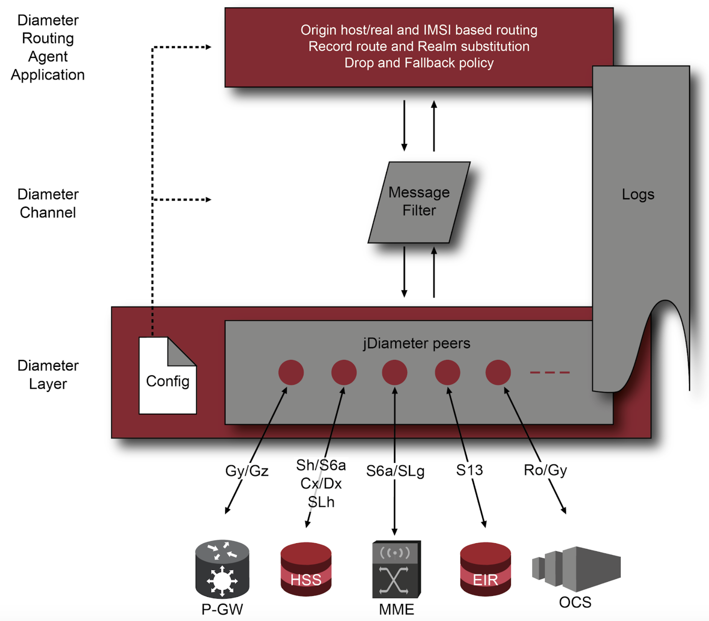
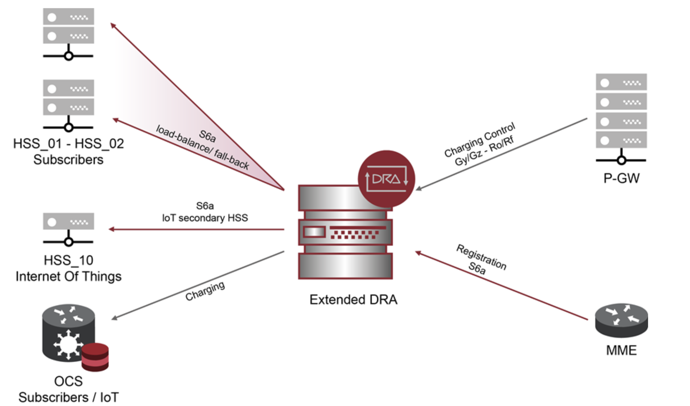

[[_dra_overview]]
= Overview

{this-platform} {this-application} is an interworking Diameter node, sitting in the middle of the Diameter core-network infrastructure, acting as a processing filter and forwarding mechanism to deliver distinct messages to the proper destination entities.

As an Naikeri software product, it stands on top of our Signaling Gateway platform and could be scaled up and out depending on customer needs, covering several Diameter reference points, such as Cx/Dx, Gy/Ro/Rf, S6a, Sh, SLh, SLg, S13/S13’ and any extension on top of Diameter IETF RFC 6733 and 3GPP standards.

{this-platform} {this-application} acts as a mediator between Diameter entities, performing routing capabilities based on origin host/realm and IMSI pattern matching, either by User-Name or Subscription-Id AVPs, to forward Diameter messages to the appropriate destination nodes, based on priority and load-balancing mechanisms well defined over an easy to write XML configuration. This component also implements fall-back mechanism, thus comprising a highly available infrastructure, furthermore, it encompasses a dropping policy to avoid undesired nodes forcing traffic routing.

Deploying our DRA would demand identifying the different interworking nodes to be configured in a couple of XML files defining the hosts, realms and peers. It would also entail the definition of the rules to be applied based on origin and IMSI. Over the configured rules and peers, the standalone software components will implement the core module as a server-based high available implementation, a container to be run over a Docker infrastructure or even a cloud Kubernetes self-curing environment.

[[_naikeri_dra_overview_features]]
== Major Features

DRA Capabilities

* IMSI discrimination from Subscription-Id or User-Name AVP.

* IMSI rule filtering by origin Realm, origin Host, IMSI.

* Origin host, realm and IMSI-based routing.

* Routing to host and/or realm destination by priority.

* Regular expression matching rules.

* Destination realm substitution.

* Load balanced rule routing.

* Fall-back and drop policy.

* Record-Route feature.

* Default rule.

* Multihoming configuration for server and server associations.

* Multiple host IP configuration as primary/stand-by.

* Multiple instance enabled service.

== Architecture and Network Interfaces

Following figure illustrates {this-platform} {this-application} software architecture.

.{this-platform} {this-application} Architecture.

Following figure illustrates {this-platform} {this-application} network topology diagram interfaces for interconnection with LTE/IMS core networks and DRA clients such as OCS or IoT devices.

.{this-platform} {this-application} Interfaces.

{this-platform} {this-application} supports the following Diameter operations within Mobile Network Operators (some of them are under development, check next sections for further details):